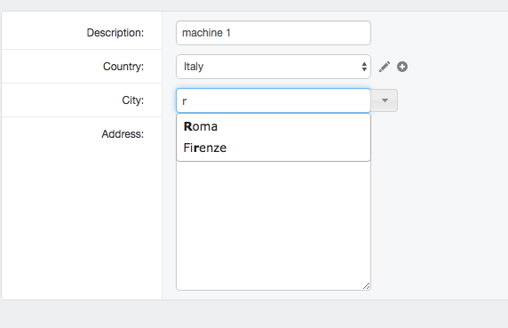
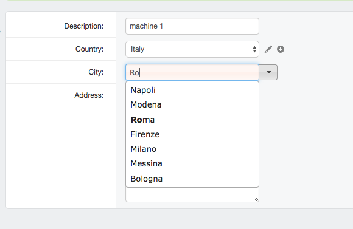
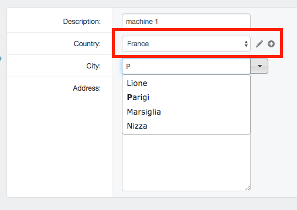

Purpose
-------

Test **django-selectable** with **django-suit** in a clean environment.

All primary keys are based on UUIDs.

Manual setup
------------

::

    $ mkvirtualenv selectable_test
    $ pip install -r requirements.txt
    $ python manage.py migrate
    $ python manage.py createsuperuser --username=admin

Note:

if using Posgresql instead of Sqlite3, do this in advance::

    $ psql -c "create user selectable_test with encrypted password 'selectable_test'"
    $ psql -c "create database selectable_test owner selectable_test"

Load sample data
----------------

Run::

    $ python manage.py loaddata sample_data.json

Usage
-----

Run::

    $ python manage.py runserver

then visit:

    `<http://127.0.0.1:8000/admin/selectable_test/machine/1f186ea5-2a64-4717-9ec6-86024de2fb2d/change/>`_

Screenshots
-----------

